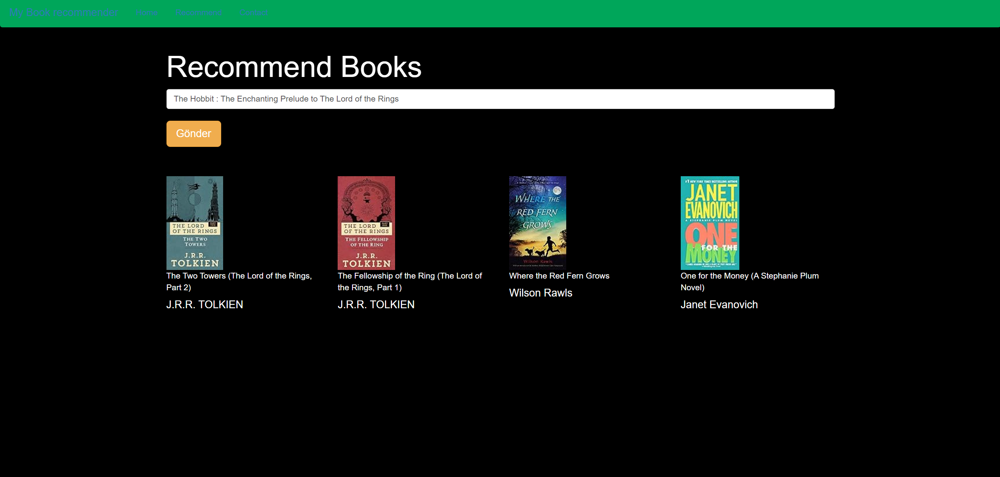

# Kitap Öneri Sistemi ve Kullanıcı Arayüzü

Bu proje, kullanıcıların tercihlerine göre kitap önerileri sunan bir öneri sistemi ve Flask ile geliştirilen web arayüzü içerir.

## Proje Amaçları

- Kullanıcıların sevdikleri kitaplara benzer kitapları önermek.
- Kullanıcıların tercihlerini analiz ederek kişiselleştirilmiş öneriler sunmak.
- Flask kullanarak kullanıcı dostu bir arayüz oluşturmak.

## Kullanılan Kütüphaneler

- **Pandas:** Veri manipülasyonu ve analizi için kullanıldı.
- **NumPy:** Veri yapıları ve matris işlemleri için kullanıldı.
- **Cosine Similarity:** Kitap benzerliği hesaplamak için kullanıldı.

## Nasıl Çalışır?

1. Proje dosyalarını klonlayın veya indirin.
2. Gerekli kütüphaneleri yükleyin.
3. Veri setini hazırlayın veya mevcut bir veri seti belirleyin.
4. Flask uygulamasını başlatın.
5. Tarayıcınızdan uygulamayı ziyaret ederek kişiselleştirilmiş kitap önerilerini alın.

